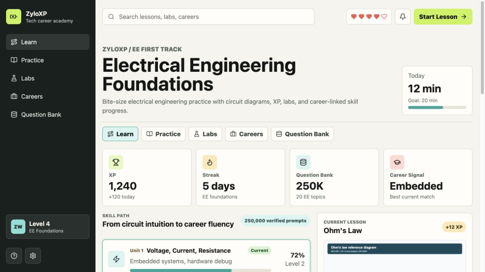

# ZyloXP

An interactive electrical engineering learning platform that combines bite-size lessons, live circuit labs, progress mechanics, and career-aligned skill paths.

[](https://react.dev/)
[](https://www.typescriptlang.org/)
[](https://vite.dev/)
[](electrical_engineering_question_bank_250000/README.md)



## Why I built it

Most engineering learning tools separate theory, practice, and career context. ZyloXP explores a single learning loop where students can study a concept, test it in an interactive circuit lab, receive immediate feedback, and understand how the skill maps to real engineering roles.

## Highlights

- Built a responsive learning experience for desktop, tablet, and mobile browsers with five connected views: Learn, Practice, Labs, Careers, and Question Bank.
- Implemented real-time Ohm's law calculations, searchable curriculum paths, six-choice lesson feedback, XP and streak mechanics, and career-match recommendations.
- Generated and validated **250,000 unique multiple-choice questions** across **20 electrical engineering topics** and **25 difficulty levels**.
- Created **12,500 SVG diagrams** with matching editable LaTeX/TikZ sources and question-to-asset cross-references.
- Added automated validation for unique IDs and stems, balanced answer positions, complete required fields, topic distribution, and diagram integrity.

## Technology

| Area | Tools and concepts |
| --- | --- |
| Front end | React 19, TypeScript, Vite, semantic HTML |
| Interface | Responsive CSS, CSS Grid, Flexbox, Lucide icons, accessible labels |
| Data | CSV, JSON, XLSX, typed curriculum models |
| Engineering content | Electrical engineering, SVG, LaTeX/TikZ, circuit diagrams |
| Quality | TypeScript checks, production builds, dataset validation |

## Architecture

```text
src/
├── App.tsx        # Dashboard, lesson player, circuit lab, and career views
├── data.ts        # Typed curriculum, question, lab, and career seed data
├── main.tsx       # React entry point
└── styles.css     # Responsive application styling

public/diagrams/   # App-facing circuit assets
electrical_engineering_question_bank_250000/
├── images/        # 12,500 generated SVG diagrams
├── latex_sources/ # Editable LaTeX/TikZ diagram sources
├── *.csv / *.json # Import-ready metadata and manifests
└── *.xlsx         # Complete 250,000-question workbook
```

## Run locally

Requirements: Node.js 22.13+ and pnpm 11.

```bash
git clone https://github.com/zhezaywang/ZyloXP.git
cd ZyloXP
pnpm install
pnpm run dev
```

Then open `http://localhost:5173`.

## Verify the project

```bash
pnpm run typecheck
pnpm run build
```

The dataset validation results are documented in [`validation_summary.json`](electrical_engineering_question_bank_250000/validation_summary.json). The generated 111 MB question CSV is excluded because it exceeds GitHub's per-file limit; the complete dataset is included in the XLSX workbook.

## Resume summary

**ZyloXP — Electrical Engineering Learning Platform**

React, TypeScript, Vite, responsive web design, data modeling, SVG, LaTeX/TikZ

- Developed a responsive, Duolingo-inspired platform with interactive lessons, skill progression, circuit simulations, and career-path recommendations.
- Built and validated a 250,000-question electrical engineering dataset across 20 topics and 25 difficulty levels.
- Generated and cross-referenced 12,500 scalable circuit diagrams with editable LaTeX/TikZ sources.
