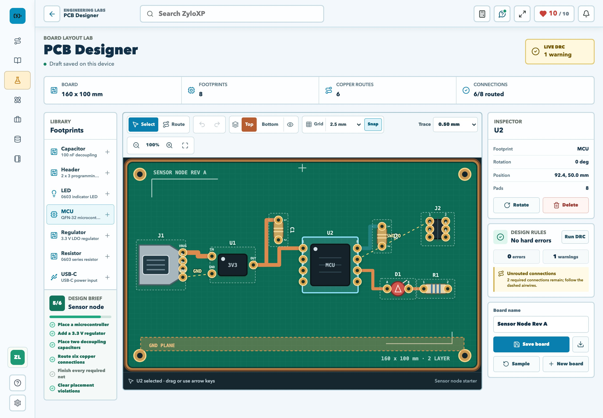

# ZyloXP

A browser-based electrical engineering workbench. Practice a calculation, change a circuit parameter, or lay out a small PCB, then keep the result in your notebook.

[Open the app](https://zhezaywang.github.io/ZyloXP/) · [Architecture](docs/architecture.md) · [Question bank](electrical_engineering_question_bank_250000/README.md)

[](https://github.com/zhezaywang/ZyloXP/actions/workflows/deploy-pages.yml)



## Try it

Choose **Start learning**. No account, API key, or installation is required.

1. Open **Labs > PCB Designer**. Move a footprint, route between pads, and check the remaining connections. Edits survive a refresh; saved boards can be exported as JSON.
2. Open **Labs > Ohm's Law Bench**. Change the source voltage or resistance and compare the current and power readings.
3. Explore **EE Atlas**, or use **Practice** to work through a question and inspect its circuit diagram.
4. Save an observation in **Notebook**. **Settings > Progress backup** exports the learning state and PCB projects together.

## What is implemented

| Workspace | What you can do |
| --- | --- |
| PCB Designer | Place and rotate footprints, route top/bottom copper, change grid and trace width, undo edits, inspect connections, and save boards. |
| Labs | Experiment with circuit, signal, and control models; complete guided calibration and fault-finding tasks. |
| Practice and Atlas | Answer questions with feedback, revisit mistakes, and explore interactive concept models and games. |
| Notebook | Collect formulas, saved questions, observations, and bench runs. |
| Learning and careers | Follow skill paths, review activity, and work through role-related project decisions. |


## Engineering decisions

- **React and TypeScript:** typed curriculum and board models, with larger workspaces loaded on demand.
- **SVG circuit and PCB views:** component geometry, pads, traces, and interaction targets share the same coordinate system.
- **Local persistence:** drafts save automatically; board validation rejects broken references and invalid geometry instead of silently dropping components.
- **Static deployment:** hash routes work on GitHub Pages without a server. A service worker caches the app shell and visited assets.
- **Verification:** storage regression tests and Playwright tests run against a production build on desktop and mobile-sized Chromium viewports. Deployment waits for these checks and the production dependency audit.

See [architecture and tradeoffs](docs/architecture.md) for the implementation map and current limits.

## Run locally

Use Node.js 24 (see [.nvmrc](.nvmrc)) and pnpm 11.0.7.

```bash
git clone https://github.com/zhezaywang/ZyloXP.git
cd ZyloXP
pnpm install --frozen-lockfile
pnpm dev
```

Open the URL printed by Vite, normally `http://localhost:5173`.

```bash
pnpm exec playwright install chromium
pnpm verify
```

`verify` runs unit tests, both TypeScript checks, a production build, and browser tests. The browser tests start their own preview server on port 4178. For individual checks, use `pnpm test`, `pnpm typecheck`, `pnpm build`, or `pnpm test:e2e` after building.

## Content and scope

The companion dataset contains **250,000 generated numerical questions** based on **100 formula templates** across **20 topics**. Its [committed validation report](electrical_engineering_question_bank_250000/validation_summary.json), dated July 23, 2026, records answer recomputation and checks on 12,500 instructional SVG diagrams. These are template variants, not 250,000 independently authored problems. The 25 level labels are organizational, not calibrated difficulty scores.

The app loads a representative subset and topic metadata. The repository includes a 50,000-row review workbook; the full CSV is excluded because it exceeds GitHub's file-size limit.

This is a learning project, not a production EDA tool. PCB checks cover placement and guided connections, not complete electrical-rule checking or manufacturing sign-off. Lab models are simplified. Career scores are learning heuristics, not professional assessments.

Profiles, progress, and the optional device PIN are local to the browser. There is **no cloud authentication or synchronization**; the PIN does not encrypt stored data. Export a backup before clearing browser storage. Offline access depends on which assets have already been visited. The initial learning path includes starter progress for exploration.
