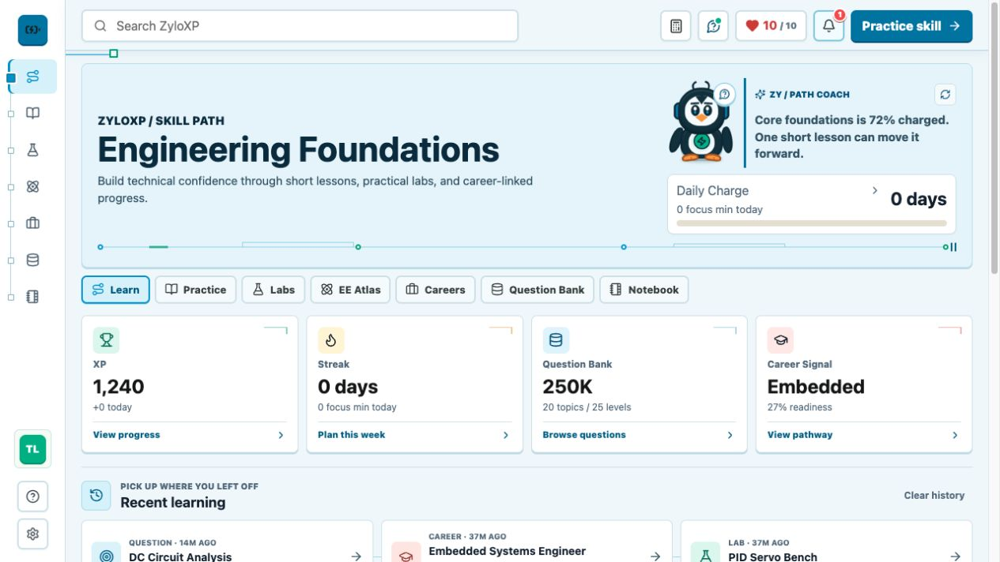
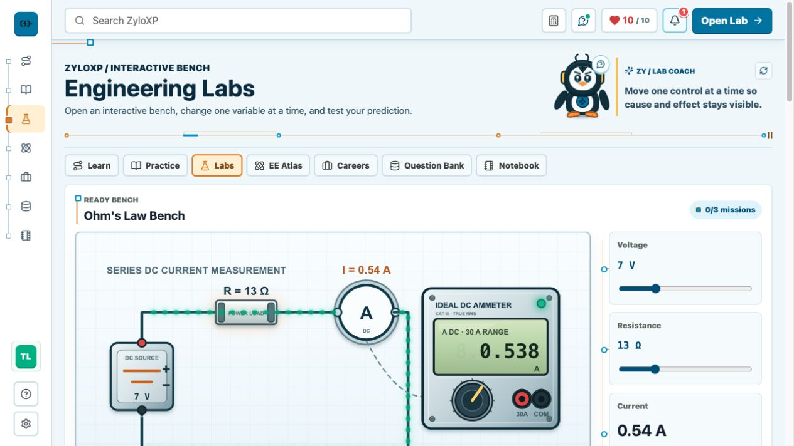
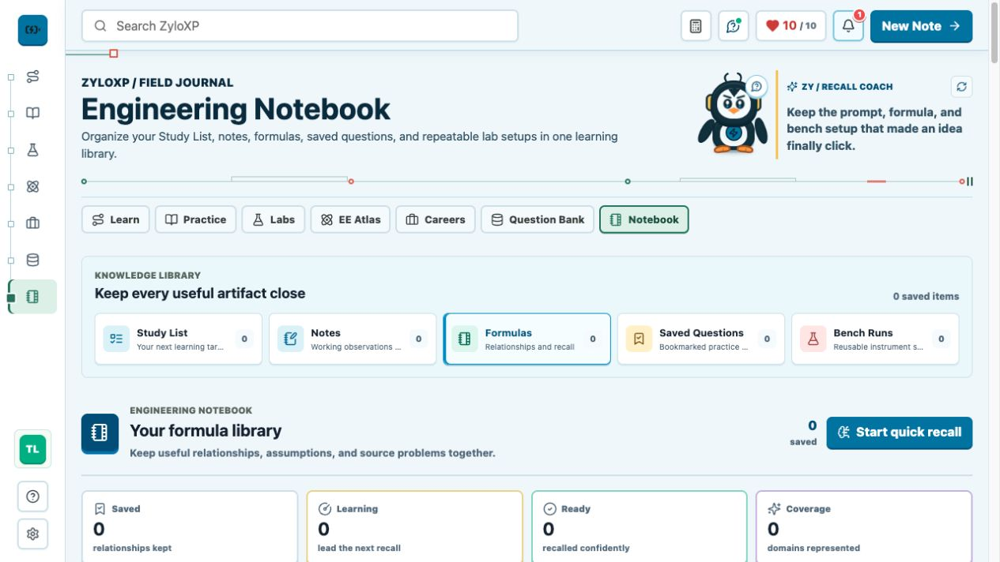

# ZyloXP

Learn electrical engineering by moving between short lessons, adaptive practice, interactive bench labs, concept visualizations, and career evidence—all in an installable, local-first web app.

**[Open the live app](https://zhezaywang.github.io/ZyloXP/)** · **[Explore the question bank](electrical_engineering_question_bank_250000/README.md)**

[](https://github.com/zhezaywang/ZyloXP/actions/workflows/deploy-pages.yml)
[](https://react.dev/)
[](https://www.typescriptlang.org/)
[](https://vite.dev/)
[](electrical_engineering_question_bank_250000/README.md)



ZyloXP connects the full learning loop: understand a relationship, answer a checked prompt, test it on an interactive bench, capture what changed, and apply the result to real engineering work.

## What you can do

- **Learn and plan:** daily missions, XP, streaks, skill paths, Focus Room, custom Study Routes, a Weekly Planner, and progress insights.
- **Practice deliberately:** confidence-rated questions, Smart Review, Mistake Lab, adaptive Power Sprints, visual problem inspection, and checkpoint exams.
- **Work at the bench:** 13 interactive lab scenarios with calibration missions, fault diagnosis, saved bench runs, and a resistor-network Circuit Workbench.
- **Explore the EE Atlas:** 28 interactive concept models across eight domains, plus seven playable engineering challenges.
- **Build an engineering notebook:** a Study List, Field Journal, formula library and recall rounds, saved questions, and reusable bench setups.
- **Use practical tools:** calculators for Ohm's law, DC power, resistor bands, loaded dividers, LED limiting, RC timing, AC reactance, and unit conversion.
- **Connect learning to work:** eight career tracks, readiness signals, guided engineering projects, and a portfolio studio.
- **Keep progress portable:** browser-local autosave, validated JSON backup and restore, installable PWA support, offline shell caching, and an optional local PIN privacy lock.

## Inside the product

| Interactive engineering labs | Engineering notebook |
| --- | --- |
|  |  |

The seven primary workspaces—Learn, Practice, Labs, EE Atlas, Careers, Question Bank, and Notebook—share progress, recent activity, study targets, and saved artifacts. Hash-based routes make every workspace refresh-safe on GitHub Pages.

## Question bank

The project is backed by a validated electrical-engineering content package containing:

- **250,000** generated and deterministically checked questions
- **20** electrical engineering topics
- **25** organizational levels per topic
- **100** governing formula templates
- **12,500** SVG instructional diagrams with matching LaTeX/TikZ sources
- **0** answer-recomputation failures and **0** image-validation failures in the latest reports

The 25 levels organize the collection; they are not psychometrically calibrated ability measures. The deployed app uses representative checked prompts and topic metadata. This repository includes a 50,000-row stratified review workbook, while the canonical 250,000-row CSV is intentionally excluded because it exceeds GitHub's per-file size limit.

See the [question bank documentation](electrical_engineering_question_bank_250000/README.md) and [latest validation summary](electrical_engineering_question_bank_250000/validation_summary.json) for the schema, assumptions, coverage, and rebuild process.

## Local-first by design

ZyloXP runs entirely in the browser and stores learner state locally. There is no hosted user account or remote progress service in this version. The optional six-digit device PIN is a privacy lock for the current browser session; it does not encrypt learning data or replace server-side authentication.

The app can be installed as a PWA and caches its application shell for offline reopening. Progress can be exported to a validated JSON backup and restored on another browser.

## Technology

| Area | Tools and concepts |
| --- | --- |
| Front end | React 19, TypeScript, Vite, lazy-loaded feature modules |
| Interface | Responsive CSS, semantic HTML, accessible labels, reduced-motion and contrast preferences |
| Learning state | Browser storage, versioned persistence, JSON backup and restore |
| Engineering content | Typed curriculum models, SVG, LaTeX/TikZ, interactive circuit and signal visualizations |
| PWA and security | Service worker, web app manifest, Content Security Policy, local Web Crypto PIN verifier |
| Delivery | GitHub Actions and GitHub Pages |

## Project map

```text
src/
├── App.tsx                       # Application shell, routing, and shared learning state
├── data.ts                      # Curriculum, labs, questions, and career tracks
├── ElectricalAtlas.tsx          # Interactive concept atlas and engineering games
├── EngineeringToolkit.tsx       # Practical engineering calculators
├── FormulaNotebookWorkspace.tsx # Formula library and quick-recall flow
├── NotebookLibrary.tsx          # Study List, notes, questions, and bench records
├── QuestionVisualStage.tsx      # Question diagrams and visual inspection tools
└── ...                          # Focus, planning, review, exams, insights, and portfolios

public/
├── diagrams/                    # App-facing reference diagrams
├── question-bank/images/        # Representative checked question visuals
├── manifest.webmanifest         # Installable PWA metadata
└── sw.js                        # Offline application-shell cache

electrical_engineering_question_bank_250000/
├── images/                      # 12,500 generated SVG diagrams
├── latex_sources/               # 12,500 editable LaTeX/TikZ sources
├── *.csv / *.json               # Metadata, formulas, manifests, and validation
└── *.xlsx                       # 50,000-row stratified review workbook
```

## Run locally

Requirements: Node.js 22.13 or newer and pnpm 11.

```bash
git clone https://github.com/zhezaywang/ZyloXP.git
cd ZyloXP
pnpm install --frozen-lockfile
pnpm run dev
```

Open `http://localhost:5173`.

## Verify the project

```bash
pnpm run typecheck
pnpm run build
pnpm run preview
```

The production build is deployed automatically from `main` through the [GitHub Pages workflow](.github/workflows/deploy-pages.yml).
